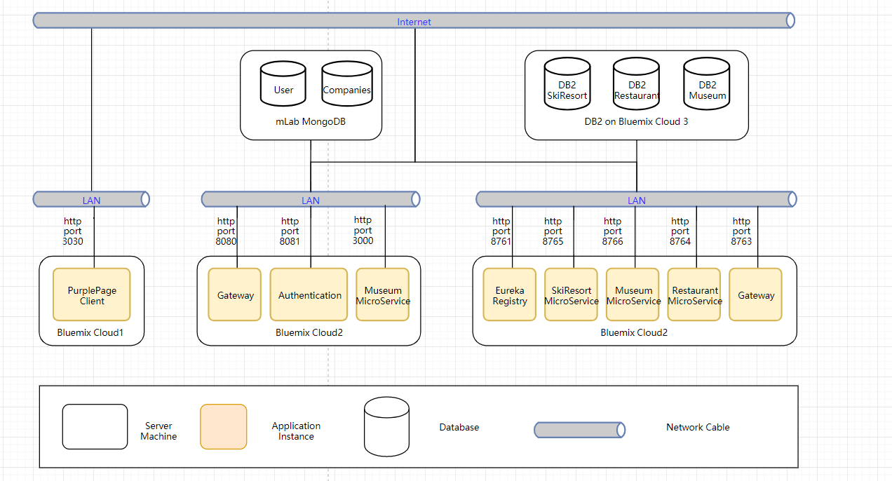
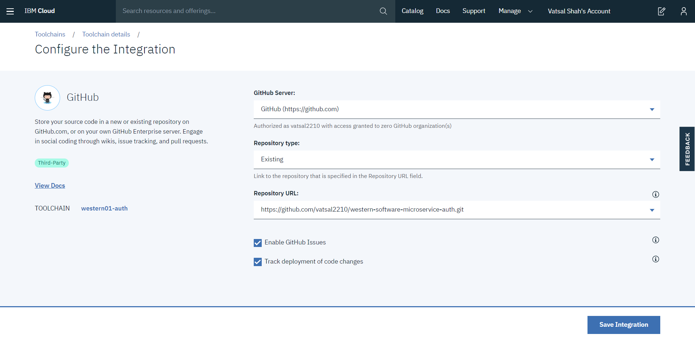
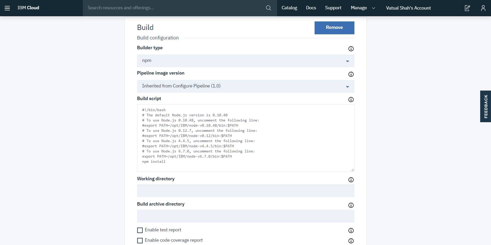

# Software-Design-Architecture-And-Microservices
Software Design and architecture project with microservices. 

## How to use this repository?

- Code: All microservices code (Auth, Gateway, UI and other microservices)
- Presentation: `Software Architecture Evaluation and Comparison`
- Final Report
- Final Presentation
- Video Overview - Working video

## Description

Software-oriented architecture presents in layers. An end-user can access the client layer. An end-user can access a website from their browser or phone device. Client services send a valid token to a Gateway, and gateway verifies that token. A Gateway sends a request to an Auth service and middleware verifies authentication. If a request is authenticated only then can a user access the protected layer. The protected layer consists of all microservices offered by the system. Each microservice is connected with a database. Service Registry and discovery identifies live/dead microservices.

## Tools and Technologies

- Frontend is built using `React`, `JavaScript`, `HTML`, `CSS`. 
- Backend is built using `Node.js`, `Express`, `MongoDB`, `SpringCloud`, `DB2 database`, `MyBatis`. 
- Srvices are deployed on `Bluemix `using Toolchains and Pipelines.

## Installation Steps

### Node.js - Gateway & Authentication app
- **`Code`** and install all microservices
- Download the code. 
- Run `npm install`
- run `npm start` to start all the services.

## Views

### Component-and-Connector View

#### Client layer
- A client layer is accessed from mobile or browser. 
- An only authenticated user can access micro-service. 
- The client sends a token in a header form to a Gateway. 
- It can be accessed from tablet, phone or browser. 
- Client layer handles a return response from the access layer for authenticated user or not-authenticated users.

#### Access Layer
- The access layer is a combination of Gateway and authentication service. 
- Gateway handles all request from a client and communicates with authentication service. 
- If Gateway get a request without token it will return not-authenticated user response. 
- When a client sends a request with a token, Gateway verifies a request with authentication service and forward to protected layer to access each microservice. 
- Protected layer returns microservice response.

#### Protected layer
- The elements within the protected layer can be accessed only via the API gateway. 
- The requests that originated from the UI will first send to Access layer where the API gateway locates, then these requests would be routed by the API gateway to the corresponding services based on the entries in the registry. 
- After processing, the responses from microservices in the protected layer would be transmitted back to the API gateway. 
- In this sense, the protected layer is hidden behind the access layer. 
- If any elements need offline for many reasons, the function of that element would be automatically decommissioned in the registry and subsequently API gateway. 
- So without restarting the whole system, we can add/remove elements in the protected layer. This is the flexibility that is provided by the design.

#### Service registry & discovery
- Service registry and discovery come from a eureka organization and are implemented by Java Spring. 
- Discovery is responsible to receive heartbeats from registries in order to maintain a list of alive microservices. 
- At the same time, in terms of making sure synchronization, the registry will check the status of microservices positively. 
- Finally, API Gateway can access to all microservices registered in the discovery server and return retrieved data to the frontend.

#### Variability Guide
- If gateway configurations changes, client connection will break-down. All the services end-points are defined in a Gateway. So, if any microservice API-endpoints are updated it is necessary to update in Gateway configuration file. 
- Moreover, if database connection as login credentials, URL or database name updates, it should be updated in each microservice. All microservice has a logging system to check logs of each service. 

## Deployment View

- Both Bluemix Cloud2 and Cloud3 are in charge of some microservices. For the Cloud2, there are Gateway, Authentication and Company Microservice which are implemented by NodeJS. They all connect to the mLab MongoDB that has two tables, user table and companies table
- Authentication service shares the same database with login and signup functions. For this part, they have already deployed on bluemix but we design it properly so that it can be deployed in any system, environment, cloud platform. 
- The last part, including Microservice registry, request gateway, three microservices are all deployed on Bluemix Cloud3. All the Eureka clients consisting of three microservices and gateway will send the heartbeat to notify the action of registering and in Eureka server will check whether the service is still alive periodically.  

### Sequence Diagram

- The end user represents the individual initiating the sequence to achieve the end result.
- The browser is the web portal through which the end user access the application and sends/receives information.
- The API Gateway serves to manage requests from the user and their related responses. It provides separation to facilitate the microservice structure.
- The authentication element authenticates the user as approved to use the system in the event a request is made without authorization.
- The DispatchServlet manages the requests and their associated responses between the gateway and specific service controllers.
- The SkiResortController then processes the query transmitted through the URL so that it can be associated with an instance of the SkiResortSvc.
- The SkiResortSvc then sends the appropriate method to the SkiResortDao class, which ultimately retrieves data from the DB2 t_skiresort.

### Bluemix:
- Step1: Create a toolchain with `Build your own toolchain`
- Step2: Add tools - Github + Delivery pipeline
- Step3: Github configuration as below:
    

- Step 4: Delivery pipeline: Create two stage: Build & Deploy
- Step5: Build stage configuration as below:

    
    

- Step6: Deploy Stage configuration as below:
    
    
    

## Directory -- Index, Glossary, Acronym List

Glossary and Acronym List 
-	API: Application Programming Interface, a set of functions allowing for the access of features of a system
-	C&C View: Component and connector view
-	DAO: Data Access Object, an object that provides an abstract interface to some type of database, providing specific data operations without exposing the details of the database
-	DB: Database
-	DB2: Relational Database Management System from IBM 
-	HTTP: protocol defines how messages are formatted and transmitted, and what actions Web servers and browsers should take in response to various commands
-	JDBC: Java Database Connectivity is an API for the programming language Java, which defines how a client may access a database.
-	JWT: JSON Web Tokens, used for securing our application through JSON-based tokens
-	Middleware: A bridge between gateway and authentication service
-	MVC: Model-View-Controller, design pattern for the separation of data and views
-	REST: Representational State Transfer, a software architectural style that defines a set of constraints to be used for creating Web services 
-	SOA: Service-Oriented Architecture, involves the deployment of services, which are units of logic that run in a network
-	UI: User Interface, the medium which the user interacts with the application
-	URL: Uniform Resource Locator, colloquially termed a web address, is a reference to a web resource

## Author

**Vatsal Shah**

[**PORTFOLIO**](https://vatsalshah.in)

[**GITHUB**](https://github.com/vatsal2210)

[**BLOG**](https://medium.com/@vatsalshah2210)

 

