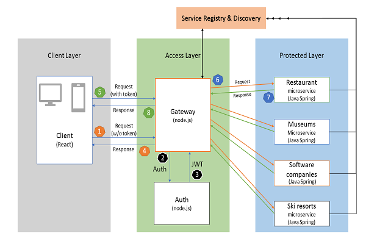
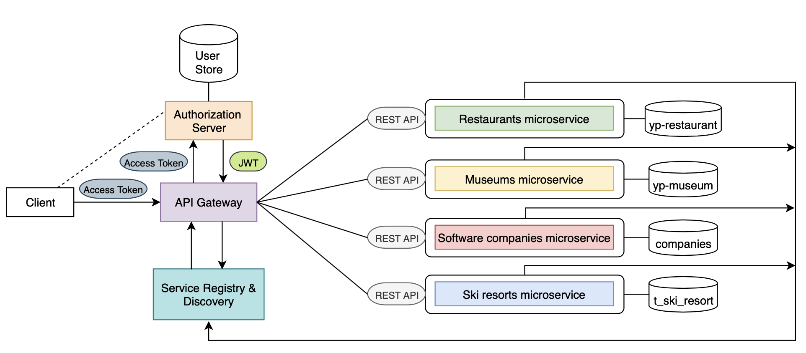
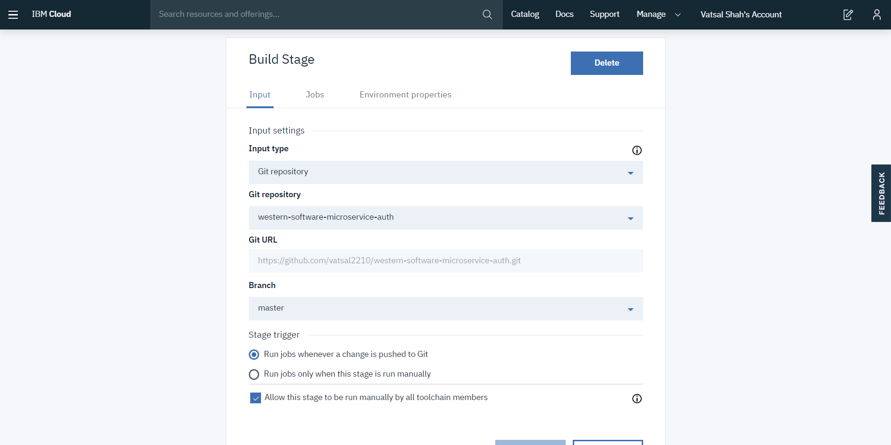
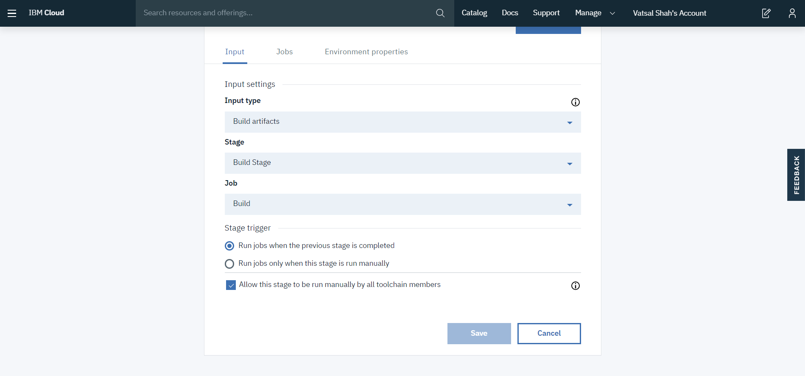
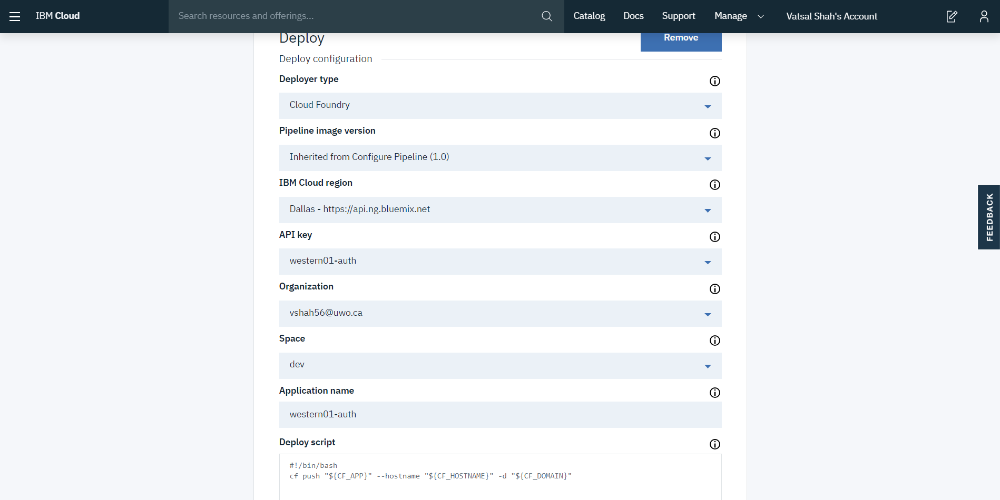

# Software-Design-Architecture-And-Microservices
Software Design and architecture project with microservices. 

## How to use this repository?

- Code: All microservices code (Auth, Gateway, UI and other microservices)
- Presentation: `Software Architecture Evaluation and Comparison`
- Final Report
- Final Presentation
- Video Overview - Working video

## Description

Software-oriented architecture presents in layers. An end-user can access the client layer. An end-user can access a website from their browser or phone device. Client services send a valid token to a Gateway, and gateway verifies that token. A Gateway sends a request to an Auth service and middleware verifies authentication. If a request is authenticated only then can a user access the protected layer. The protected layer consists of all microservices offered by the system. Each microservice is connected with a database. Service Registry and discovery identifies live/dead microservices.

## Views

### Component-and-Connector View

### Sequence Diagram

## Deployment View

## Installation Steps

### Node.js - Gateway & Authentication app
- **`Code`** and install all microservices
- Download the code. 
- Run `npm install`
- run `npm start` to start all the services.

### Bluemix:
- Step1: Create a toolchain with `Build your own toolchain`
- Step2: Add tools - Github + Delivery pipeline
- Step3: Github configuration as below:

- Step 4: Delivery pipeline: Create two stage: Build & Deploy
- Step5: Build stage configuration as below:

- Step6: Deploy Stage configuration as below:

